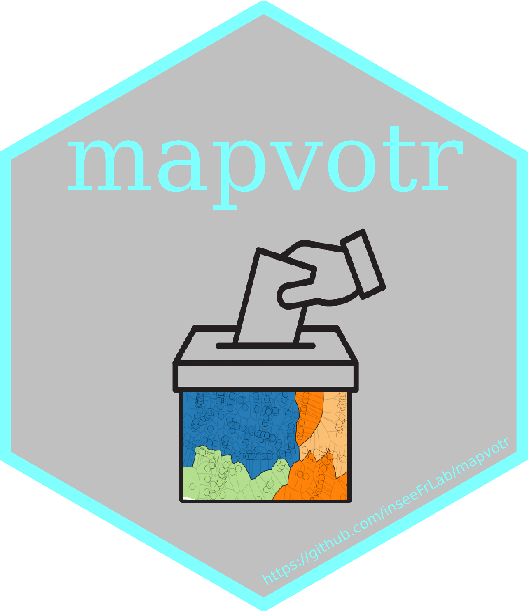

# mapvotr <a href='https://github.com/jpramil/mapvotr'></a> 


  <!-- badges: start -->
  [](https://github.com/jpramil/mapvotr/actions/workflows/R-CMD-check.yaml)
  <!-- badges: end -->

Production de contours approximés de bureaux de votes (BV) à partir de la [base des adresses géolocalisées du Répertoire électoral unique (REU)](LIEN_A_AJOUTER_ULTERIEUREMENT) diffusée par l'Insee.


## Premiers pas 

**Installation**

```
devtools::install_github("InseeFrLab/mapvotr")
```

Pour un exemple d'utilisation et pour davantage d'informations sur la méthode, se référer à la documentation en ligne de [mapvotr](LIEN_A_AJOUTER_ULTERIEUREMENT)

## En savoir plus

- [Article de blog documentant la génèse et un cas d'utilisation du package](LIEN_A_AJOUTER_ULTERIEUREMENT)
- [Outil similaire développé en python par Etalab](LIEN_A_AJOUTER_ULTERIEUREMENT)
